# Mermaid Charts - BUYSEWA E-commerce Platform

**Version:** 1.0
**Date:** 2024

---

## 1. System Architecture Diagram

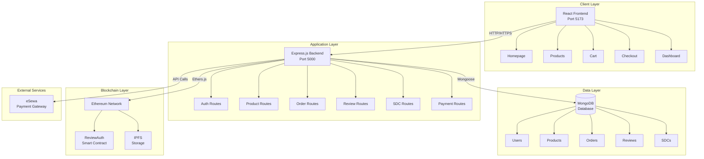
```mermaid
graph TB
    subgraph "Client Layer"
        A[React Frontend<br/>Port 5173]
        A1[Homepage]
        A2[Products]
        A3[Cart]
        A4[Checkout]
        A5[Dashboard]
        A --> A1
        A --> A2
        A --> A3
        A --> A4
        A --> A5
    end

    subgraph "Application Layer"
        B[Express.js Backend<br/>Port 5000]
        B1[Auth Routes]
        B2[Product Routes]
        B3[Order Routes]
        B4[Review Routes]
        B5[SDC Routes]
        B6[Payment Routes]
        B --> B1
        B --> B2
        B --> B3
        B --> B4
        B --> B5
        B --> B6
    end

    subgraph "Data Layer"
        C[(MongoDB<br/>Database)]
        C1[Users]
        C2[Products]
        C3[Orders]
        C4[Reviews]
        C5[SDCs]
        C --> C1
        C --> C2
        C --> C3
        C --> C4
        C --> C5
    end

    subgraph "Blockchain Layer"
        D[Ethereum Network]
        D1[ReviewAuth<br/>Smart Contract]
        D2[IPFS<br/>Storage]
        D --> D1
        D --> D2
    end

    subgraph "External Services"
        E[eSewa<br/>Payment Gateway]
    end

    A -->|HTTP/HTTPS| B
    B -->|Mongoose| C
    B -->|Ethers.js| D
    B -->|API Calls| E
```

---

## 2. Database Entity Relationship Diagram (ERD)

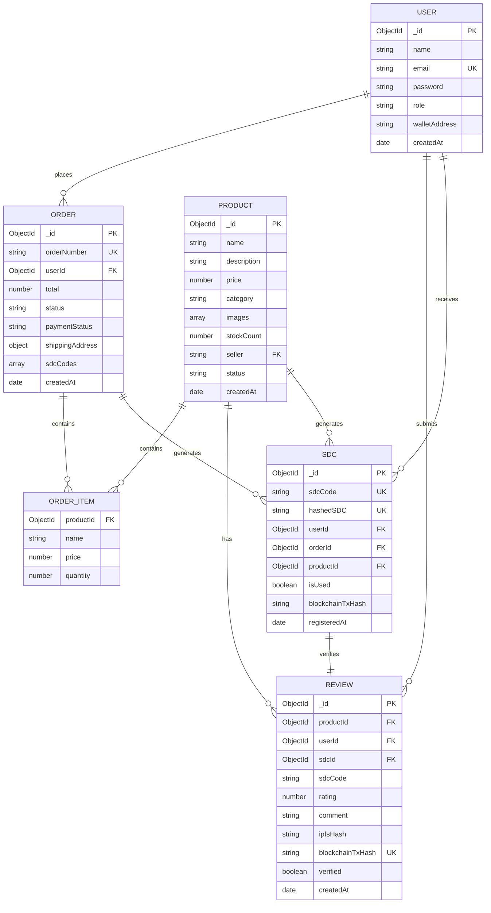
```mermaid
erDiagram
    USER ||--o{ ORDER : places
    USER ||--o{ REVIEW : submits
    USER ||--o{ SDC : receives
    PRODUCT ||--o{ ORDER_ITEM : contains
    PRODUCT ||--o{ REVIEW : has
    PRODUCT ||--o{ SDC : generates
    ORDER ||--o{ ORDER_ITEM : contains
    ORDER ||--o{ SDC : generates
    SDC ||--|| REVIEW : verifies

    USER {
        ObjectId _id PK
        string name
        string email UK
        string password
        string role
        string walletAddress
        date createdAt
    }

    PRODUCT {
        ObjectId _id PK
        string name
        string description
        number price
        string category
        array images
        number stockCount
        string seller FK
        string status
        date createdAt
    }

    ORDER {
        ObjectId _id PK
        string orderNumber UK
        ObjectId userId FK
        number total
        string status
        string paymentStatus
        object shippingAddress
        array sdcCodes
        date createdAt
    }

    ORDER_ITEM {
        ObjectId productId FK
        string name
        number price
        number quantity
    }

    REVIEW {
        ObjectId _id PK
        ObjectId productId FK
        ObjectId userId FK
        ObjectId sdcId FK
        string sdcCode
        number rating
        string comment
        string ipfsHash
        string blockchainTxHash UK
        boolean verified
        date createdAt
    }

    SDC {
        ObjectId _id PK
        string sdcCode UK
        string hashedSDC UK
        ObjectId userId FK
        ObjectId orderId FK
        ObjectId productId FK
        boolean isUsed
        string blockchainTxHash
        date registeredAt
    }
```

---

## 3. Use Case Diagram

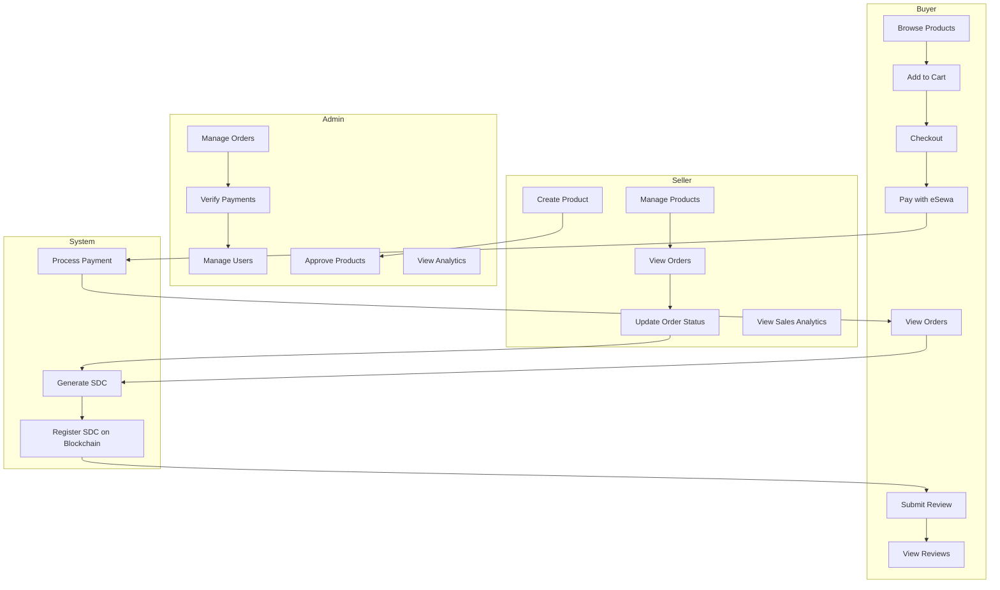
```mermaid
graph TB
    subgraph "Buyer"
        B1[Browse Products]
        B2[Add to Cart]
        B3[Checkout]
        B4[Pay with eSewa]
        B5[View Orders]
        B6[Submit Review]
        B7[View Reviews]
    end

    subgraph "Seller"
        S1[Create Product]
        S2[Manage Products]
        S3[View Orders]
        S4[Update Order Status]
        S5[View Sales Analytics]
    end

    subgraph "Admin"
        A1[Approve Products]
        A2[Manage Orders]
        A3[Verify Payments]
        A4[Manage Users]
        A5[View Analytics]
    end

    subgraph "System"
        SY1[Generate SDC]
        SY2[Register SDC on Blockchain]
        SY3[Process Payment]
    end

    B1 --> B2
    B2 --> B3
    B3 --> B4
    B4 --> SY3
    SY3 --> B5
    B5 --> SY1
    SY1 --> SY2
    SY2 --> B6
    B6 --> B7

    S1 --> A1
    S2 --> S3
    S3 --> S4
    S4 --> SY1
    S5

    A1
    A2 --> A3
    A3 --> A4
    A5
```

---

## 4. User Registration Flow

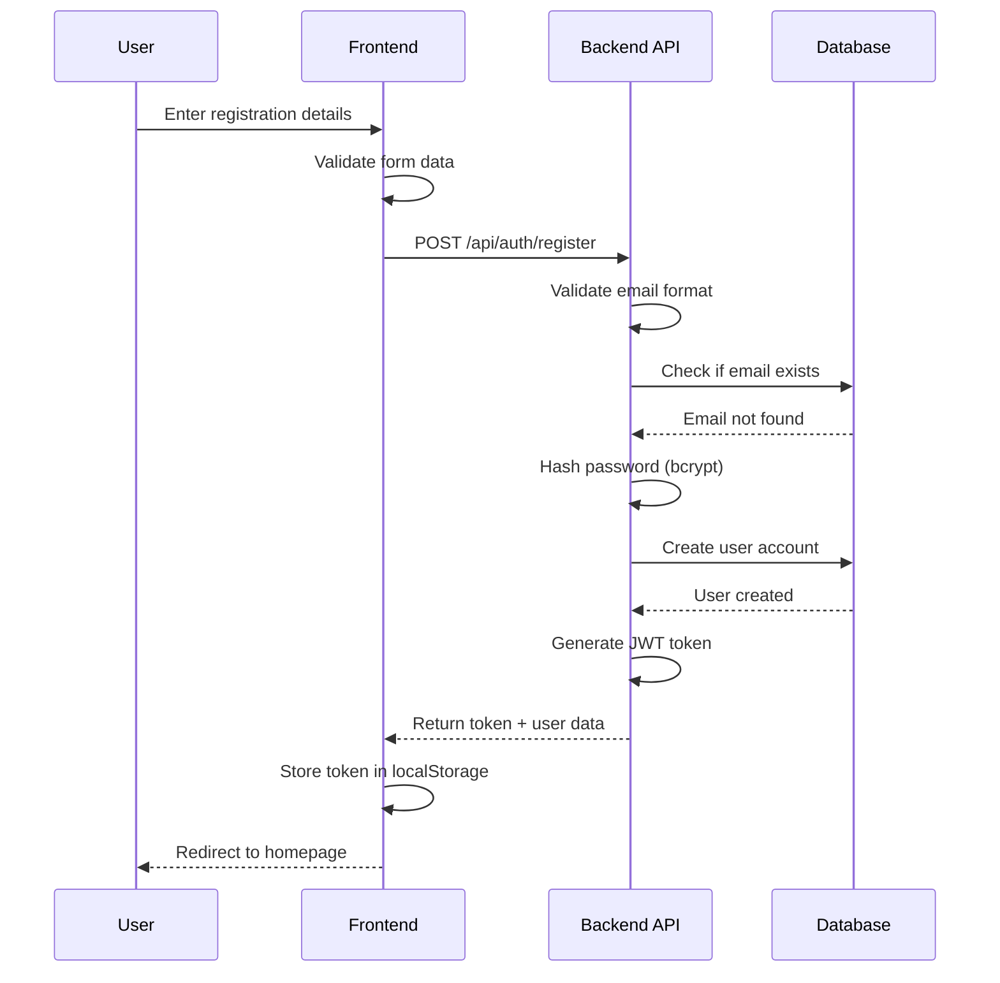
```mermaid
sequenceDiagram
    participant U as User
    participant F as Frontend
    participant B as Backend API
    participant D as Database

    U->>F: Enter registration details
    F->>F: Validate form data
    F->>B: POST /api/auth/register
    B->>B: Validate email format
    B->>D: Check if email exists
    D-->>B: Email not found
    B->>B: Hash password (bcrypt)
    B->>D: Create user account
    D-->>B: User created
    B->>B: Generate JWT token
    B-->>F: Return token + user data
    F->>F: Store token in localStorage
    F-->>U: Redirect to homepage
```

---

## 5. Order Creation and Payment Flow

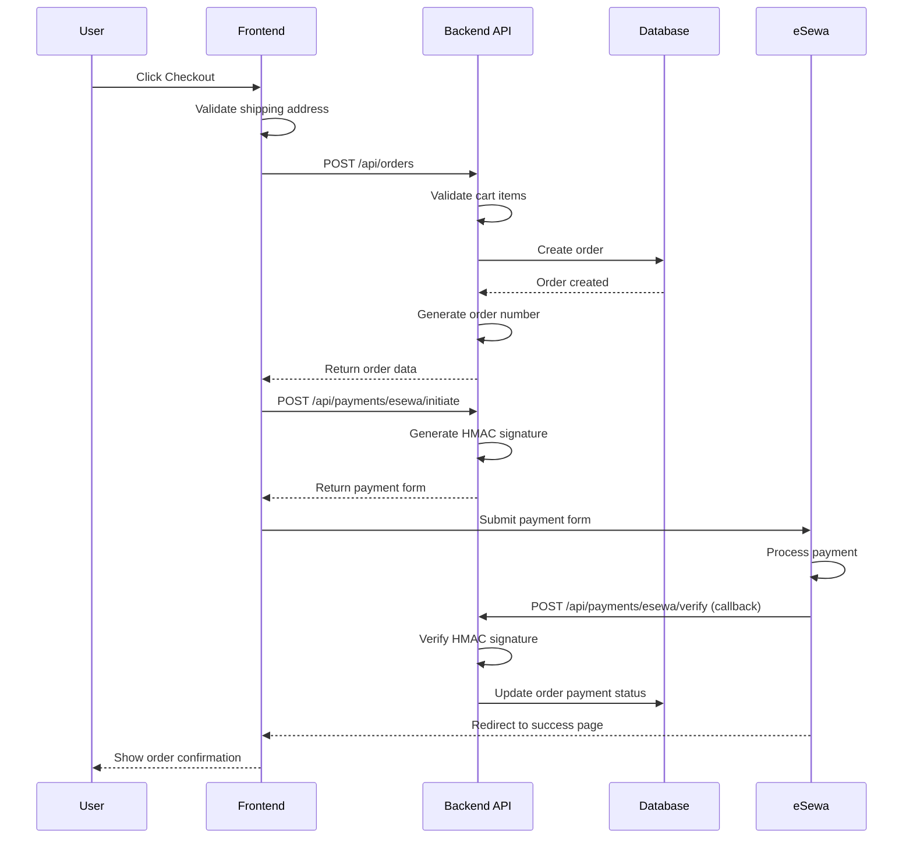
```mermaid
sequenceDiagram
    participant U as User
    participant F as Frontend
    participant B as Backend API
    participant D as Database
    participant E as eSewa

    U->>F: Click Checkout
    F->>F: Validate shipping address
    F->>B: POST /api/orders
    B->>B: Validate cart items
    B->>D: Create order
    D-->>B: Order created
    B->>B: Generate order number
    B-->>F: Return order data
    F->>B: POST /api/payments/esewa/initiate
    B->>B: Generate HMAC signature
    B-->>F: Return payment form
    F->>E: Submit payment form
    E->>E: Process payment
    E->>B: POST /api/payments/esewa/verify (callback)
    B->>B: Verify HMAC signature
    B->>D: Update order payment status
    E-->>F: Redirect to success page
    F-->>U: Show order confirmation
```

---

## 6. SDC Generation and Review Flow

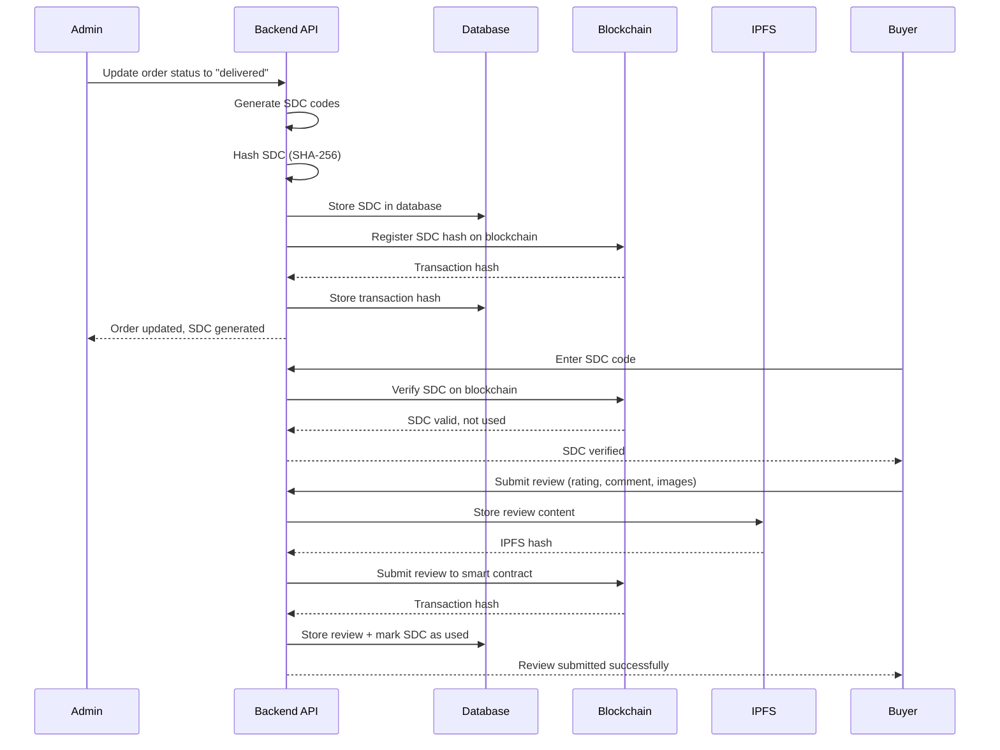
```mermaid
sequenceDiagram
    participant A as Admin
    participant B as Backend API
    participant D as Database
    participant BC as Blockchain
    participant IPFS as IPFS
    participant U as Buyer

    A->>B: Update order status to "delivered"
    B->>B: Generate SDC codes
    B->>B: Hash SDC (SHA-256)
    B->>D: Store SDC in database
    B->>BC: Register SDC hash on blockchain
    BC-->>B: Transaction hash
    B->>D: Store transaction hash
    B-->>A: Order updated, SDC generated

    U->>B: Enter SDC code
    B->>BC: Verify SDC on blockchain
    BC-->>B: SDC valid, not used
    B-->>U: SDC verified

    U->>B: Submit review (rating, comment, images)
    B->>IPFS: Store review content
    IPFS-->>B: IPFS hash
    B->>BC: Submit review to smart contract
    BC-->>B: Transaction hash
    B->>D: Store review + mark SDC as used
    B-->>U: Review submitted successfully
```

---

## 7. Component Architecture

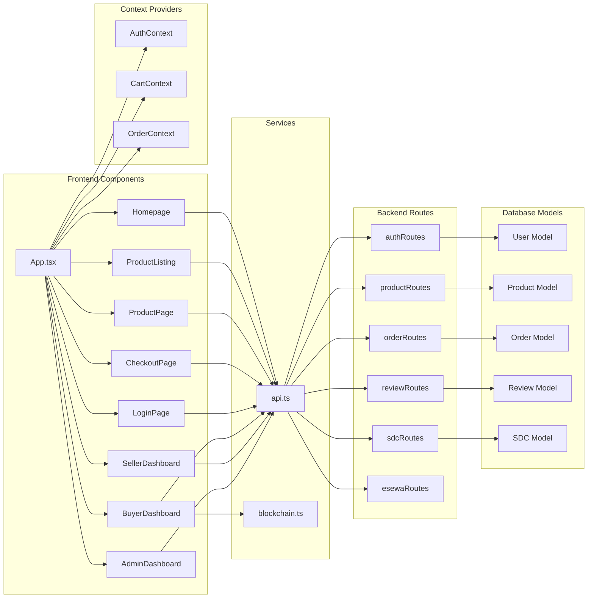
```mermaid
graph LR
    subgraph "Frontend Components"
        A[App.tsx]
        A1[Homepage]
        A2[ProductListing]
        A3[ProductPage]
        A4[CheckoutPage]
        A5[LoginPage]
        A6[BuyerDashboard]
        A7[SellerDashboard]
        A8[AdminDashboard]

        A --> A1
        A --> A2
        A --> A3
        A --> A4
        A --> A5
        A --> A6
        A --> A7
        A --> A8
    end

    subgraph "Context Providers"
        C1[AuthContext]
        C2[CartContext]
        C3[OrderContext]

        A --> C1
        A --> C2
        A --> C3
    end

    subgraph "Services"
        S1[api.ts]
        S2[blockchain.ts]

        A1 --> S1
        A2 --> S1
        A3 --> S1
        A4 --> S1
        A5 --> S1
        A6 --> S1
        A6 --> S2
        A7 --> S1
        A8 --> S1
    end

    subgraph "Backend Routes"
        R1[authRoutes]
        R2[productRoutes]
        R3[orderRoutes]
        R4[reviewRoutes]
        R5[sdcRoutes]
        R6[esewaRoutes]

        S1 --> R1
        S1 --> R2
        S1 --> R3
        S1 --> R4
        S1 --> R5
        S1 --> R6
    end

    subgraph "Database Models"
        M1[User Model]
        M2[Product Model]
        M3[Order Model]
        M4[Review Model]
        M5[SDC Model]

        R1 --> M1
        R2 --> M2
        R3 --> M3
        R4 --> M4
        R5 --> M5
    end
```

---

## 8. Shopping Cart Flow

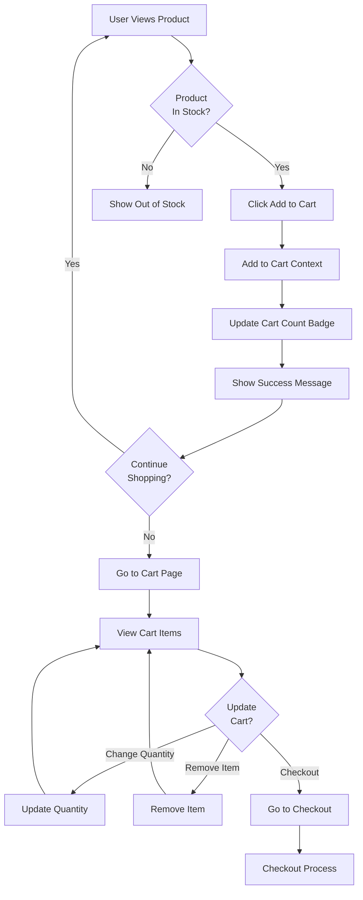
```mermaid
flowchart TD
    A[User Views Product] --> B{Product<br/>In Stock?}
    B -->|Yes| C[Click Add to Cart]
    B -->|No| D[Show Out of Stock]
    C --> E[Add to Cart Context]
    E --> F[Update Cart Count Badge]
    F --> G[Show Success Message]
    G --> H{Continue<br/>Shopping?}
    H -->|Yes| A
    H -->|No| I[Go to Cart Page]
    I --> J[View Cart Items]
    J --> K{Update<br/>Cart?}
    K -->|Change Quantity| L[Update Quantity]
    K -->|Remove Item| M[Remove Item]
    K -->|Checkout| N[Go to Checkout]
    L --> J
    M --> J
    N --> O[Checkout Process]
```

---

## 9. Product Approval Workflow

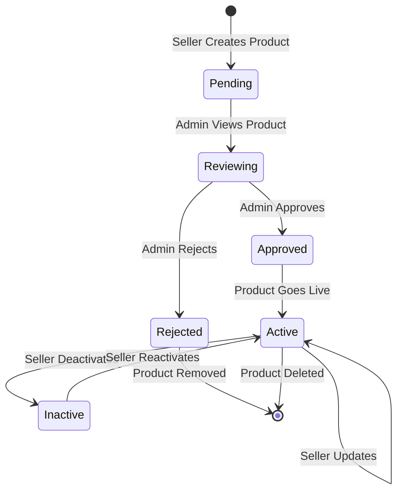
```mermaid
stateDiagram-v2
    [*] --> Pending: Seller Creates Product
    Pending --> Reviewing: Admin Views Product
    Reviewing --> Approved: Admin Approves
    Reviewing --> Rejected: Admin Rejects
    Approved --> Active: Product Goes Live
    Active --> Inactive: Seller Deactivates
    Active --> Active: Seller Updates
    Inactive --> Active: Seller Reactivates
    Rejected --> [*]: Product Removed
    Active --> [*]: Product Deleted
```

---

## 10. Authentication Flow

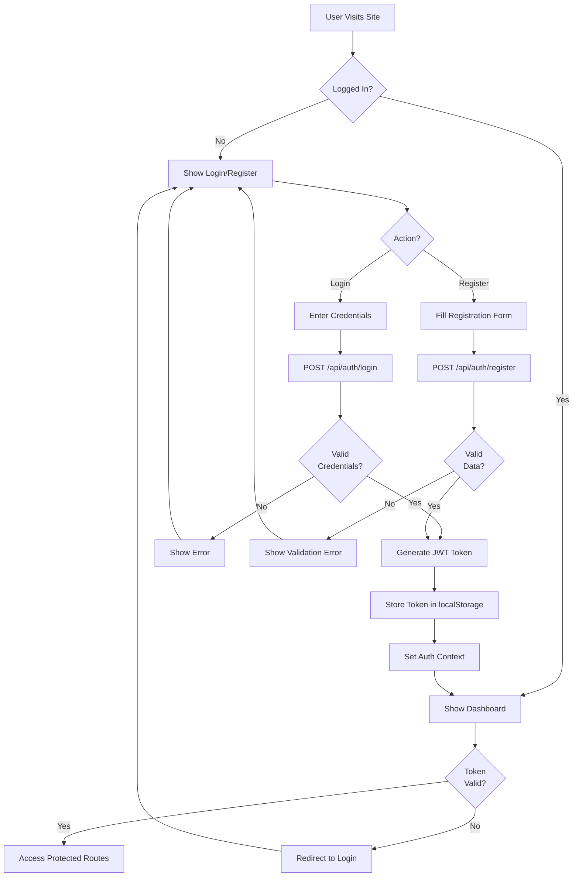
```mermaid
flowchart TD
    A[User Visits Site] --> B{Logged In?}
    B -->|No| C[Show Login/Register]
    B -->|Yes| D[Show Dashboard]

    C --> E{Action?}
    E -->|Login| F[Enter Credentials]
    E -->|Register| G[Fill Registration Form]

    F --> H[POST /api/auth/login]
    G --> I[POST /api/auth/register]

    H --> J{Valid<br/>Credentials?}
    I --> K{Valid<br/>Data?}

    J -->|Yes| L[Generate JWT Token]
    J -->|No| M[Show Error]
    K -->|Yes| L
    K -->|No| N[Show Validation Error]

    L --> O[Store Token in localStorage]
    O --> P[Set Auth Context]
    P --> D

    M --> C
    N --> C

    D --> Q{Token<br/>Valid?}
    Q -->|Yes| R[Access Protected Routes]
    Q -->|No| S[Redirect to Login]
    S --> C
```

---

## 11. Deployment Architecture

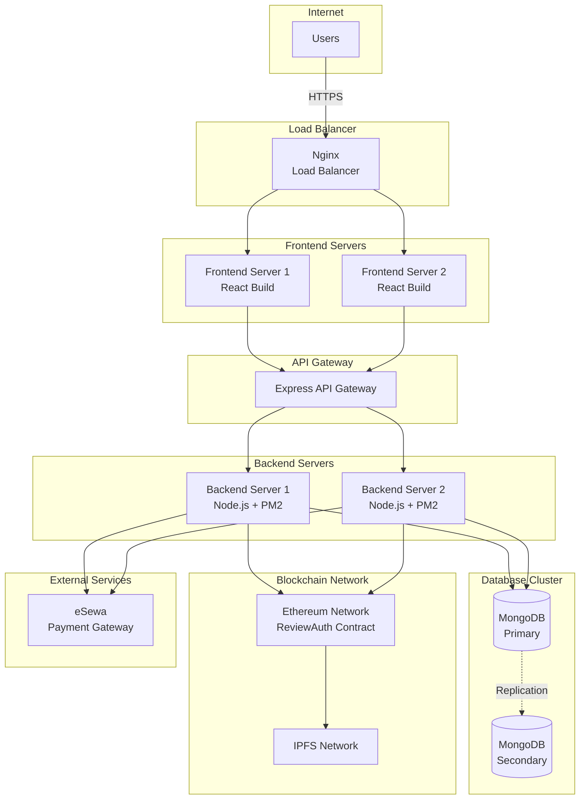
```mermaid
graph TB
    subgraph "Internet"
        U[Users]
    end

    subgraph "Load Balancer"
        LB[Nginx<br/>Load Balancer]
    end

    subgraph "Frontend Servers"
        F1[Frontend Server 1<br/>React Build]
        F2[Frontend Server 2<br/>React Build]
    end

    subgraph "API Gateway"
        AG[Express API Gateway]
    end

    subgraph "Backend Servers"
        B1[Backend Server 1<br/>Node.js + PM2]
        B2[Backend Server 2<br/>Node.js + PM2]
    end

    subgraph "Database Cluster"
        DB1[(MongoDB<br/>Primary)]
        DB2[(MongoDB<br/>Secondary)]
        DB1 -.->|Replication| DB2
    end

    subgraph "Blockchain Network"
        BC[Ethereum Network<br/>ReviewAuth Contract]
        IPFS[IPFS Network]
    end

    subgraph "External Services"
        ES[eSewa<br/>Payment Gateway]
    end

    U -->|HTTPS| LB
    LB --> F1
    LB --> F2
    F1 --> AG
    F2 --> AG
    AG --> B1
    AG --> B2
    B1 --> DB1
    B2 --> DB1
    B1 --> BC
    B2 --> BC
    BC --> IPFS
    B1 --> ES
    B2 --> ES
```

---

## 12. Review Submission Sequence

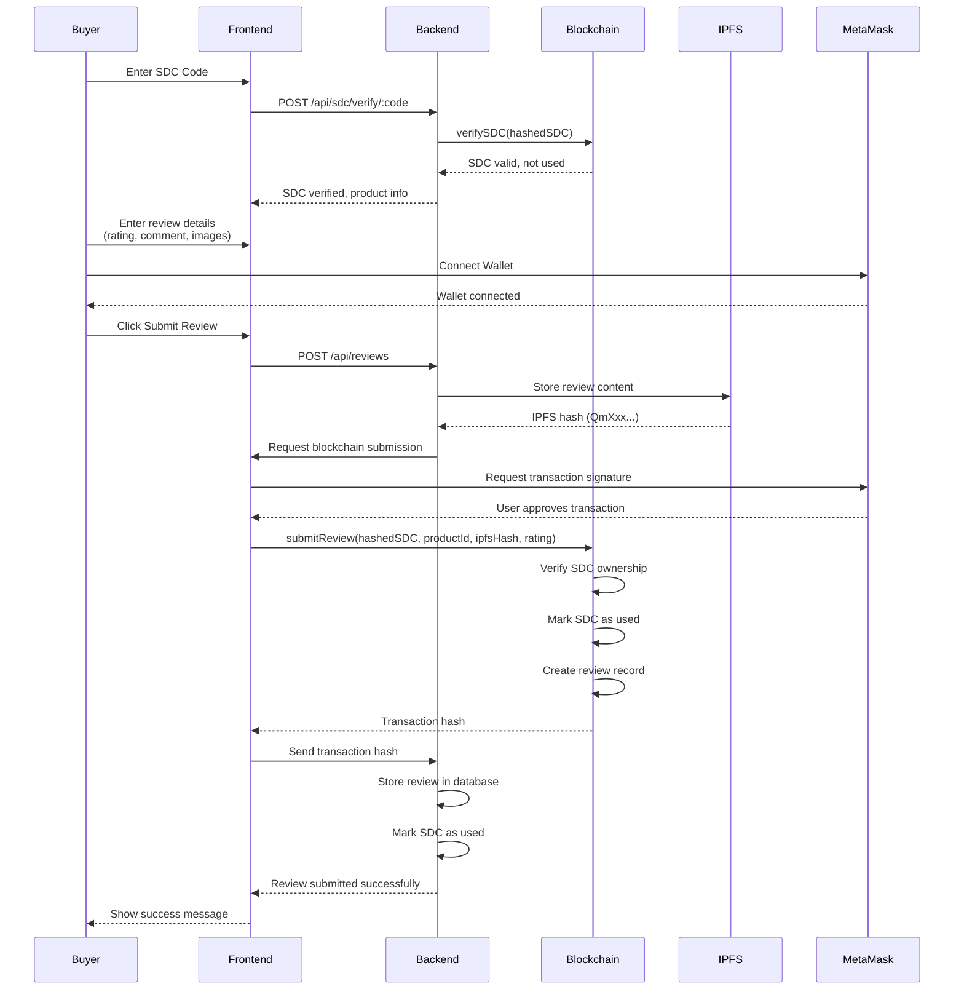
```mermaid
sequenceDiagram
    participant U as Buyer
    participant F as Frontend
    participant B as Backend
    participant BC as Blockchain
    participant IPFS as IPFS
    participant MM as MetaMask

    U->>F: Enter SDC Code
    F->>B: POST /api/sdc/verify/:code
    B->>BC: verifySDC(hashedSDC)
    BC-->>B: SDC valid, not used
    B-->>F: SDC verified, product info

    U->>F: Enter review details<br/>(rating, comment, images)
    U->>MM: Connect Wallet
    MM-->>U: Wallet connected

    U->>F: Click Submit Review
    F->>B: POST /api/reviews
    B->>IPFS: Store review content
    IPFS-->>B: IPFS hash (QmXxx...)

    B->>F: Request blockchain submission
    F->>MM: Request transaction signature
    MM-->>F: User approves transaction
    F->>BC: submitReview(hashedSDC, productId, ipfsHash, rating)
    BC->>BC: Verify SDC ownership
    BC->>BC: Mark SDC as used
    BC->>BC: Create review record
    BC-->>F: Transaction hash

    F->>B: Send transaction hash
    B->>B: Store review in database
    B->>B: Mark SDC as used
    B-->>F: Review submitted successfully
    F-->>U: Show success message
```

---

## 13. Order Status Flow

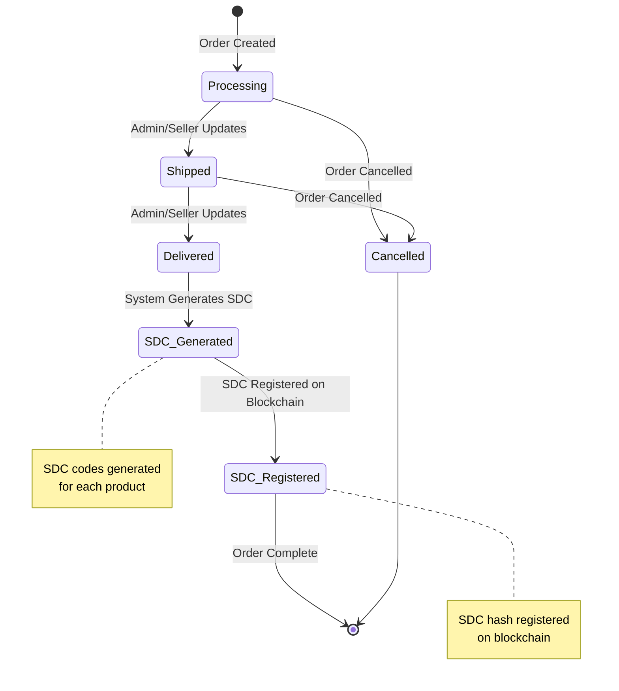
```mermaid
stateDiagram-v2
    [*] --> Processing: Order Created
    Processing --> Shipped: Admin/Seller Updates
    Shipped --> Delivered: Admin/Seller Updates
    Delivered --> SDC_Generated: System Generates SDC
    SDC_Generated --> SDC_Registered: SDC Registered on Blockchain
    SDC_Registered --> [*]: Order Complete

    Processing --> Cancelled: Order Cancelled
    Shipped --> Cancelled: Order Cancelled
    Cancelled --> [*]

    note right of SDC_Generated
        SDC codes generated
        for each product
    end note

    note right of SDC_Registered
        SDC hash registered
        on blockchain
    end note
```

---

## 14. Payment Verification Flow

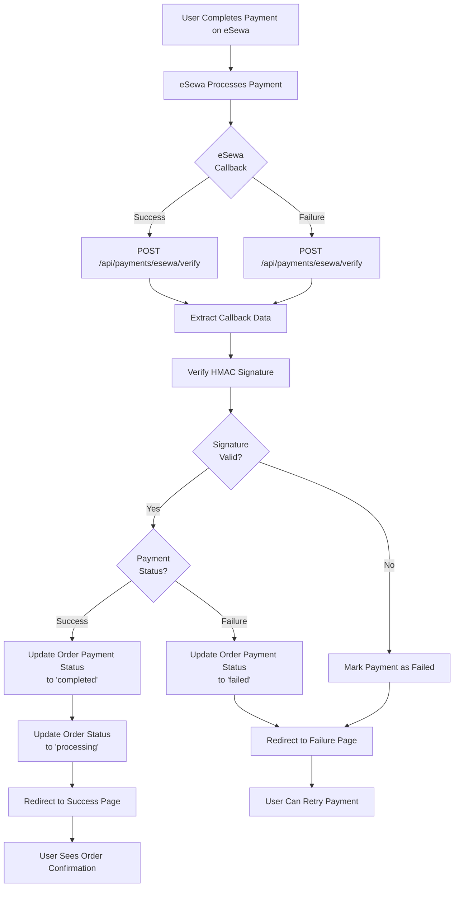
```mermaid
flowchart TD
    A[User Completes Payment on eSewa] --> B[eSewa Processes Payment]
    B --> C{eSewa<br/>Callback}
    C -->|Success| D[POST /api/payments/esewa/verify]
    C -->|Failure| E[POST /api/payments/esewa/verify]

    D --> F[Extract Callback Data]
    E --> F

    F --> G[Verify HMAC Signature]
    G --> H{Signature<br/>Valid?}

    H -->|Yes| I{Payment<br/>Status?}
    H -->|No| J[Mark Payment as Failed]

    I -->|Success| K[Update Order Payment Status<br/>to 'completed']
    I -->|Failure| L[Update Order Payment Status<br/>to 'failed']

    K --> M[Update Order Status<br/>to 'processing']
    M --> N[Redirect to Success Page]

    L --> O[Redirect to Failure Page]
    J --> O

    N --> P[User Sees Order Confirmation]
    O --> Q[User Can Retry Payment]
```

---

## 15. User Roles and Permissions


```mermaid
graph TB
    subgraph "Buyer Permissions"
        B1[Browse Products]
        B2[Add to Cart]
        B3[Create Orders]
        B4[View Own Orders]
        B5[Submit Reviews]
        B6[View Reviews]
    end

    subgraph "Seller Permissions"
        S1[Create Products]
        S2[Edit Own Products]
        S3[Delete Own Products]
        S4[View Own Orders]
        S5[Update Order Status]
        S6[View Sales Analytics]
    end

    subgraph "Admin Permissions"
        A1[All Buyer Permissions]
        A2[All Seller Permissions]
        A3[Approve/Reject Products]
        A4[Manage All Orders]
        A5[Verify Payments]
        A6[Manage Users]
        A7[View Platform Analytics]
        A8[Moderate Reviews]
    end

    A1 --> B1
    A1 --> B2
    A1 --> B3
    A1 --> B4
    A1 --> B5
    A1 --> B6

    A2 --> S1
    A2 --> S2
    A2 --> S3
    A2 --> S4
    A2 --> S5
    A2 --> S6
```

---

## 16. Data Flow - Complete Purchase Cycle


```mermaid
flowchart LR
    A[Browse Products] --> B[Add to Cart]
    B --> C[View Cart]
    C --> D[Checkout]
    D --> E[Enter Shipping Address]
    E --> F[Select Payment Method]
    F --> G[Create Order]
    G --> H[Initiate Payment]
    H --> I[eSewa Payment]
    I --> J[Payment Callback]
    J --> K[Verify Payment]
    K --> L[Order Status: Processing]
    L --> M[Order Status: Shipped]
    M --> N[Order Status: Delivered]
    N --> O[Generate SDC Codes]
    O --> P[Register SDC on Blockchain]
    P --> Q[Buyer Receives SDC]
    Q --> R[Submit Review]
    R --> S[Store Review on IPFS]
    S --> T[Submit Review to Blockchain]
    T --> U[Review Displayed]
```

---

## 17. API Request Flow

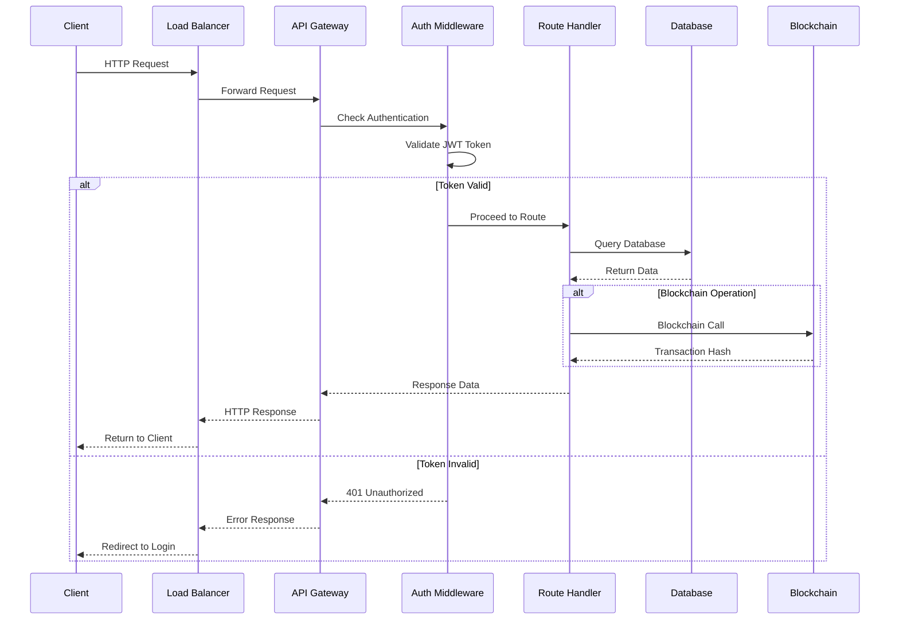
```mermaid
sequenceDiagram
    participant C as Client
    participant LB as Load Balancer
    participant API as API Gateway
    participant AUTH as Auth Middleware
    participant ROUTE as Route Handler
    participant DB as Database
    participant BC as Blockchain

    C->>LB: HTTP Request
    LB->>API: Forward Request
    API->>AUTH: Check Authentication
    AUTH->>AUTH: Validate JWT Token

    alt Token Valid
        AUTH->>ROUTE: Proceed to Route
        ROUTE->>DB: Query Database
        DB-->>ROUTE: Return Data

        alt Blockchain Operation
            ROUTE->>BC: Blockchain Call
            BC-->>ROUTE: Transaction Hash
        end

        ROUTE-->>API: Response Data
        API-->>LB: HTTP Response
        LB-->>C: Return to Client
    else Token Invalid
        AUTH-->>API: 401 Unauthorized
        API-->>LB: Error Response
        LB-->>C: Redirect to Login
    end
```

---

## 18. Error Handling Flow

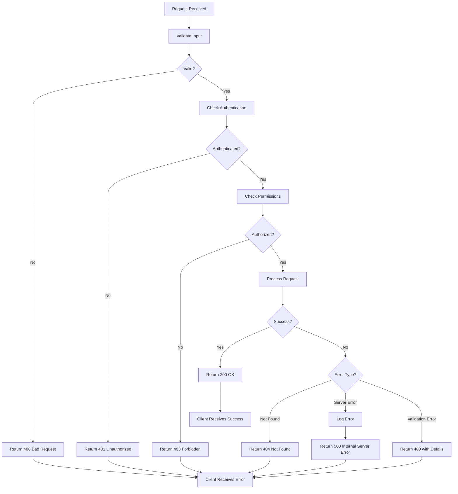
```mermaid
flowchart TD
    A[Request Received] --> B[Validate Input]
    B --> C{Valid?}
    C -->|No| D[Return 400 Bad Request]
    C -->|Yes| E[Check Authentication]
    E --> F{Authenticated?}
    F -->|No| G[Return 401 Unauthorized]
    F -->|Yes| H[Check Permissions]
    H --> I{Authorized?}
    I -->|No| J[Return 403 Forbidden]
    I -->|Yes| K[Process Request]
    K --> L{Success?}
    L -->|Yes| M[Return 200 OK]
    L -->|No| N{Error Type?}
    N -->|Not Found| O[Return 404 Not Found]
    N -->|Server Error| P[Log Error]
    P --> Q[Return 500 Internal Server Error]
    N -->|Validation Error| R[Return 400 with Details]

    D --> S[Client Receives Error]
    G --> S
    J --> S
    O --> S
    Q --> S
    R --> S
    M --> T[Client Receives Success]
```

---

## 19. Blockchain Smart Contract Structure

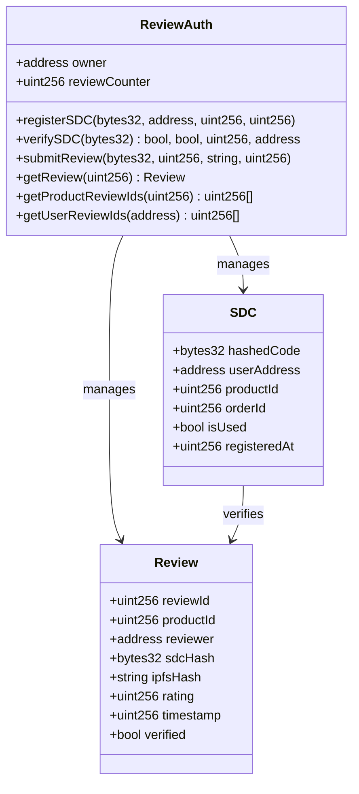
```mermaid
classDiagram
    class ReviewAuth {
        +address owner
        +uint256 reviewCounter
        +registerSDC(bytes32, address, uint256, uint256)
        +verifySDC(bytes32) bool, bool, uint256, address
        +submitReview(bytes32, uint256, string, uint256)
        +getReview(uint256) Review
        +getProductReviewIds(uint256) uint256[]
        +getUserReviewIds(address) uint256[]
    }

    class SDC {
        +bytes32 hashedCode
        +address userAddress
        +uint256 productId
        +uint256 orderId
        +bool isUsed
        +uint256 registeredAt
    }

    class Review {
        +uint256 reviewId
        +uint256 productId
        +address reviewer
        +bytes32 sdcHash
        +string ipfsHash
        +uint256 rating
        +uint256 timestamp
        +bool verified
    }

    ReviewAuth --> SDC : manages
    ReviewAuth --> Review : manages
    SDC --> Review : verifies
```

---

## 20. CI/CD Pipeline Flow

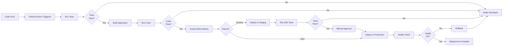
```mermaid
flowchart LR
    A[Code Push] --> B[GitHub Actions Triggered]
    B --> C[Run Tests]
    C --> D{Tests<br/>Pass?}
    D -->|No| E[Notify Developer]
    D -->|Yes| F[Build Application]
    F --> G[Run Linter]
    G --> H{Linter<br/>Pass?}
    H -->|No| E
    H -->|Yes| I[Create Build Artifacts]
    I --> J{Branch?}
    J -->|develop| K[Deploy to Staging]
    J -->|main| L[Deploy to Production]
    K --> M[Run E2E Tests]
    M --> N{Tests<br/>Pass?}
    N -->|No| E
    N -->|Yes| O[Manual Approval]
    O --> L
    L --> P[Health Check]
    P --> Q{Health<br/>OK?}
    Q -->|No| R[Rollback]
    Q -->|Yes| S[Deployment Complete]
    R --> E
```

---

## Usage Instructions

### In Markdown Files

These Mermaid diagrams can be embedded directly in markdown files:

```markdown
```mermaid
graph TB
    A --> B
```
```

### Online Viewers

1. **Mermaid Live Editor:** https://mermaid.live
   - Copy any diagram code
   - Paste into the editor
   - View and export

2. **GitHub/GitLab:**
   - Mermaid diagrams render automatically in markdown files

3. **VS Code:**
   - Install "Markdown Preview Mermaid Support" extension
   - Diagrams will render in preview

### Export Options

- **PNG/SVG:** Use Mermaid Live Editor export
- **PDF:** Use markdown-to-pdf tools with Mermaid support
- **HTML:** Embed in HTML with Mermaid.js library

---

**Document Status:** Approved
**Version History:**
- v1.0 (2024) - Initial Mermaid Charts Collection

